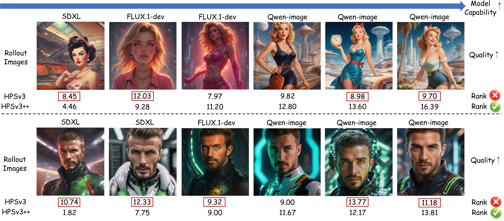
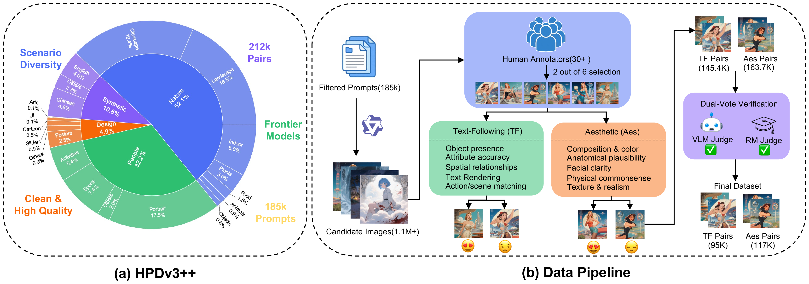
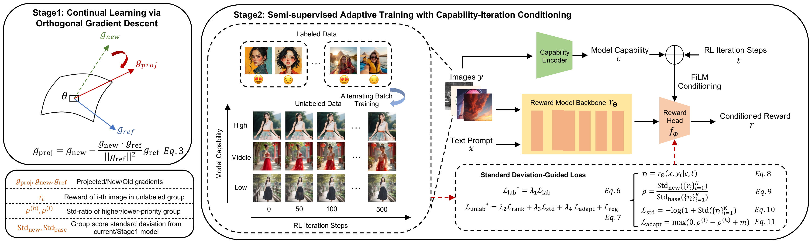

# HPSv3++: Scaling Reward Models Across the Full Spectrum of Diffusion Model Capabilities

> 🚧 **Code and dataset are coming soon.** The full **two-stage training / evaluation code**, the **HPDv3++ dataset**, and the **HPSv3++ reward-model weights** will be released here.

HPSv3++ is a **capability-aware and RL-iteration-aware** text-to-image (T2I) reward model. A Capability Encoder implicitly infers the generative ability of the model that produced an image, while the RL iteration step is supplied as an explicit condition. The two signals are jointly modulated through FiLM conditioning, so that a single reward model produces calibrated preference scores across the full spectrum of *generators of differing capability* and *different stages of RL optimization*.

<p align="center">
  
</p>

---

## Highlights

- **HPDv3++ dataset** -- a two-axis preference dataset built on a frontier generator (Qwen-Image), annotated along **text-following (TF)** and **aesthetic (Aes)** quality. From 185K filtered prompts and over 1.1M candidate images, 30+ human annotators perform a 2-of-6 selection, followed by dual-vote verification (a VLM judge and an RM judge). This yields about **212K preference pairs** (95K TF + 117K Aes), spanning generators of varying capability and multiple RL-optimization iterations.

<p align="center"></p>

- **Two-stage training** -- **Stage 1** performs continual learning via Orthogonal Gradient Descent (OGD), extending the reward model to frontier generators without catastrophic forgetting. **Stage 2** is semi-supervised adaptive training that conditions the reward on model capability and RL iteration step through FiLM, supervised by labeled pairs and the within-group std of unlabeled rollouts.

<p align="center"></p>

- **State-of-the-art preference prediction** across HPDv3, GenAI-Bench, and the proposed HPDv3++, and consistent improvements in GenEval when used as the reward for T2I reinforcement learning across diverse generators. Pairwise preference prediction accuracy (%) on multiple benchmarks (best in **bold**):

| Model | ImageReward | PickScore | HPDv3 | GenAI-Bench | MJ Align. | MJ Qual. | HPDv3++ Aes. | HPDv3++ T-Fol. |
|---|:---:|:---:|:---:|:---:|:---:|:---:|:---:|:---:|
| CLIP ViT-H/14   | 57.1 | 60.8 | 48.6 | 56.0 | 58.4 | 68.4 | 51.8 | 55.5 |
| Aesthetic Score | 57.4 | 56.8 | 59.9 | 57.3 | 56.9 | 83.0 | 56.1 | 57.5 |
| ImageReward     | 65.1 | 61.1 | 58.6 | 63.4 | 64.2 | 81.8 | 58.5 | 63.6 |
| PickScore       | 61.6 | 70.5 | 65.6 | 70.0 | 65.0 | 89.6 | 57.9 | 63.1 |
| UnifiedReward   | 63.8 | 62.5 | 72.0 | 72.4 | 60.8 | 97.2 | 57.9 | 67.1 |
| HPSv3           | **66.8** | **72.2** | 76.9 | 70.8 | 69.0 | 97.6 | 74.8 | 73.3 |
| **HPSv3++ (Ours)** | 66.0 | 70.5 | **86.7** | **76.3** | **69.8** | **98.7** | **79.1** | **88.1** |

---

## Release plan

| Item | Status |
|---|---|
| Paper | Available |
| Training / evaluation code | Coming soon |
| HPDv3++ dataset | Coming soon |
| HPSv3++ reward-model weights | Coming soon |

The code, dataset, and weights will be fully open-sourced upon acceptance.

---

## Citation

```bibtex
@misc{hpsv3pp,
  title  = {HPSv3++: Scaling Reward Models Across the Full Spectrum of Diffusion Model Capabilities},
  author = {HPSv3++ Team},
  year   = {2026},
  url    = {https://github.com/PlantPotatoOnMoon/HPSv3-PlusPlus}
}
```
