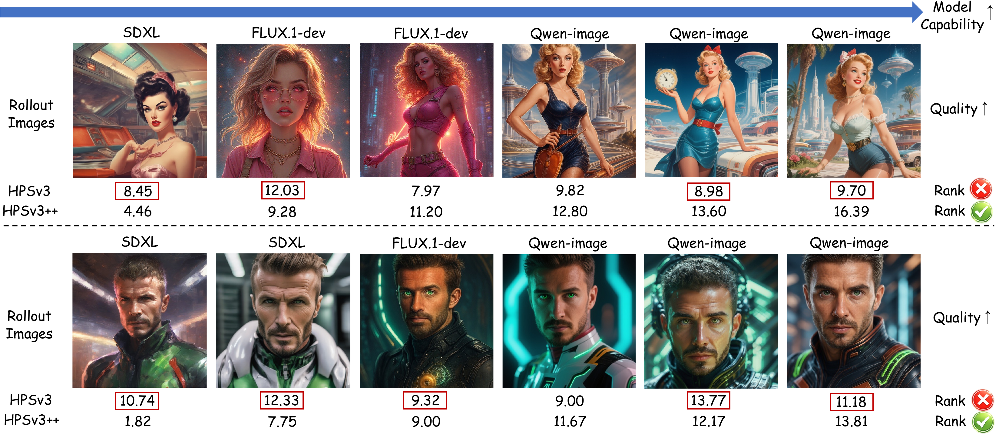
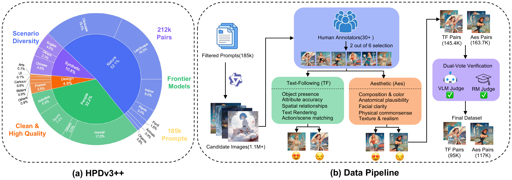
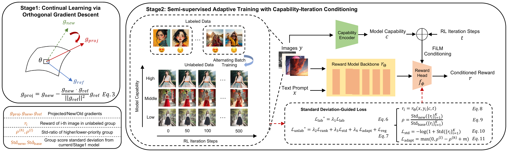

# HPSv3++ & HPDv3++: Reward Model and Human Preference Dataset

<p align="center">
  <a href="https://huggingface.co/datasets/Junjun2333/HPDv3-PlusPlus"></a>
  <a href="https://huggingface.co/Junjun2333/HPSv3-PlusPlus"></a>
  <a href="https://arxiv.org/abs/2606.14657" title="HPSv3++: Scaling Reward Models Across the Full Spectrum of Diffusion Model Capabilities"></a>
  <a href="citation.bib"></a>
  <a href="#中文简介"></a>
  <br>
  <a href="#dataset-hpdv3">Dataset guide</a> ·
  <a href="#1-installation">Install</a> ·
  <a href="#2-download-weights-and-dataset">Download weights and data</a> ·
  <a href="#using-hpsv3-as-a-reward-model">Score images</a> ·
  <a href="#3-training-two-stages-run-separately">Train</a> ·
  <a href="#4-inference-and-evaluation">Evaluate</a>
</p>

## 📰 News

- 🤝 **2026-09** — **[SenseNova-U1.5](https://github.com/OpenSenseNova/SenseNova-U1)** uses **HPSv3++** as a preference reward for RL post-training. See its [technical report (§3.3)](https://github.com/OpenSenseNova/SenseNova-U1/blob/main/docs/pdf/SenseNOVA_U1_5.pdf#page=12).
- 🎉 **2026-07** — **HPSv3++** is accepted to **ACM Multimedia 2026 (ACM MM 2026)**!
- 🚀 **2026-06** — Released **HPSv3++**, **HPDv3++**, and training/evaluation code, with [reward-model support for **Flow-GRPO**](#using-hpsv3-as-a-reward-model).

<p align="center">
  
</p>

---

## What you can use

| Task | Released resource | Entry point |
|---|---|---|
| Human preference scoring and image ranking | HPSv3++ reward-model checkpoint | [Python scoring API](#using-hpsv3-as-a-reward-model) |
| Train your own aesthetic or text-following reward model | HPDv3++ aesthetic and text-following training pairs | [Independent dataset splits](#ready-to-use-training-and-test-splits) |
| Evaluate image preference prediction | HPDv3++ fixed preference test sets across two axes | [Pairwise evaluation](#4-inference-and-evaluation) |
| Reproduce capability- and iteration-conditioned reward modeling | Two-stage training code and configurations | [Training](#3-training-two-stages-run-separately) |
| Use the scorer in diffusion model RL fine-tuning | Scoring API with an RL iteration condition | [Reward settings](#using-hpsv3-as-a-reward-model) |

See [release status and limitations](#release-status-and-limitations) for the Flow-GRPO integration and training prerequisites.

## Dataset: HPDv3++

**HPDv3++ (HPDv3-PlusPlus)** is an approximately **212K-pair human preference training dataset and benchmark** for modern **text-to-image reward modeling**. Built from **Qwen-Image** generations, it covers both **text fidelity / text-following** and **aesthetic quality**.

Use HPDv3++ independently to **train your own image reward model**, **benchmark preference prediction**, or study **aesthetic assessment and text–image alignment**. The ready-to-use training and test splits need only the provided images and JSON annotations. They do not require the HPSv3++ model, its training code, or the original HPDv3 dataset.

**[HPDv3++ dataset card](https://huggingface.co/datasets/Junjun2333/HPDv3-PlusPlus)** · [Download data](https://huggingface.co/datasets/Junjun2333/HPDv3-PlusPlus) · [Dataset citation](#citation)

<p align="center"></p>

### Ready-to-use training and test splits

The following four files are self-contained preference data and can be used
**independently of the HPSv3++ model, training code, or evaluation code**:

| File | Pairs | Use |
|---|---|---|
| `train/train_aes.json` | 100,463 | Training -- aesthetic preference |
| `train/train_tf.json`  | 90,908  | Training -- text-following preference |
| `test/test_aes.json`   | 5,720   | Evaluation -- aesthetic |
| `test/test_tf.json`    | 4,465   | Evaluation -- text-following |

Each record is simply `{"path1": <preferred>, "path2": <non-preferred>, "prompt": <text>}`,
where `path1` is the human-preferred image and `path2` the less-preferred one (same
convention as HPSv3/HPDv3). All images they reference are in the split-tar image pool
hosted here (`images/qwen_image/...`); train and test are disjoint, including across the
aes/tf axes. Minimal example:

```python
import json
data = json.load(open("datasets/train/train_aes.json"))
for r in data:
    win  = "datasets/" + r["path1"]   # preferred image
    lose = "datasets/" + r["path2"]   # non-preferred image
    prompt = r["prompt"]
    # ... train your own reward model with (prompt, win > lose)
```

> The other JSON files (`stage1_labeled`, `stage1_ref`, `stage2_labeled`, `rollout`,
> `ogd_std`) are only needed to reproduce the HPSv3++ two-stage training pipeline below.
> In particular `stage1_ref.json` references the original HPDv3 images (download separately).

### Full schema

All data files are **JSON arrays of objects**, one record per element. Fields we did not annotate are left as `null`. Every image path (`image_path` / `path1` / `path2`) is a **relative** path of the form `images/...`, resolved against the dataset root `datasets/`.

**`train/{train_aes,train_tf}.json`, `test/{test_aes,test_tf}.json`** -- the ready-to-use preference pairs described above; each element holds only `path1, path2, prompt` (`path1` preferred). Train and test are disjoint, including across the aes/tf axes.

**`train/rollout.json`** -- Stage 2 unlabeled rollouts, long format, one image per element. Records are aggregated into image groups by `group_id` at training time; supervision comes from the within-group score std rather than human labels.

| Field | Meaning |
|---|---|
| `group_id` | Group identifier (same prompt + same tier + same `iter_step` form one group) |
| `source` | `capability` (multi-tier capability group) or `iteration` (RL iteration trajectory group) |
| `prompt` | Text prompt |
| `tier` | Generator tier |
| `iter_step` | RL iteration step (always 0 for the capability source) |
| `capability` | Continuous capability score mapped from `tier` |
| `iter_norm` | Normalized iteration value, `min(1, iter_step/1000)` |
| `level` | Discrete quality level (valid for the capability source) |
| `image_path` | Relative image path |
| `ogd_std` | Pre-computed per-group std (used by the std-guided loss) |

**`train/ogd_std.json`** -- each element is `{group_key, std}`, the pre-computed per-group std. The same values are already embedded in the `ogd_std` field of `rollout.json`; this file is an independent backup.

**`train/{stage1_labeled,stage2_labeled,stage1_ref}.json`** -- preference pairs:

| Field | Meaning |
|---|---|
| `path1` / `path2` | Preferred / non-preferred image (`path1` is better) |
| `prompt` | Text prompt |
| `choice_dist` / `confidence` / `model1` / `model2` | Annotation distribution / confidence / generator names (`null` when unannotated) |

---

## Repository layout

```
.
|-- README.md
|-- citation.bib                       # Paper citation for the dataset and model
|-- requirements.txt
|-- train_stage1.sh / train_stage2.sh   # Two-stage training entry scripts
|-- eval.sh                             # Evaluate HPSv3++ on HPDv3++
|-- checkpoints/
|   |-- config.json
|   `-- hpsv3++.pth                      # Weights (17.6 GB), downloaded from Hugging Face
|-- datasets/                           # HPDv3++ dataset, downloaded from Hugging Face
|   |-- train/{train_aes,train_tf,stage1_labeled,stage1_ref,stage2_labeled,rollout,ogd_std}.json
|   |-- test/{test_aes,test_tf}.json
|   `-- images/                         # Unified image pool (deduplicated)
|-- hpsv3/
|   |-- train_stage1.py / train_stage2.py / inference.py
|   |-- config/{train_stage1,train_stage2}.yaml
|   |-- dataset/ model/ trainer/ utils/
`-- evaluate/evaluate.py                # HPDv3++ pairwise preference evaluation
```

---

## 1. Installation

```bash
git clone https://github.com/PlantPotatoOnMoon/HPSv3-PlusPlus.git
cd HPSv3-PlusPlus

conda create -n hpsv3pp python=3.10 -y
conda activate hpsv3pp
pip install -r requirements.txt
```

The `Qwen/Qwen3-VL-8B-Instruct` backbone is downloaded automatically from Hugging Face on first run. You may also pre-download it and set `model_name_or_path` in the config to a local path.

## 2. Download weights and dataset

The HPSv3++ weights and the HPDv3++ dataset are released on Hugging Face and are not stored in this repository. Download them and place them at the repository root.

- Model weights: [Junjun2333/HPSv3-PlusPlus](https://huggingface.co/Junjun2333/HPSv3-PlusPlus)
- Dataset (HPDv3++): [Junjun2333/HPDv3-PlusPlus](https://huggingface.co/datasets/Junjun2333/HPDv3-PlusPlus)

```bash
pip install -U "huggingface_hub[cli]"

# Model weights -> checkpoints/hpsv3++.pth
hf download Junjun2333/HPSv3-PlusPlus hpsv3++.pth --local-dir checkpoints

# Dataset (JSON annotations + split-tar image pool) -> datasets/
hf download Junjun2333/HPDv3-PlusPlus --repo-type dataset --local-dir datasets
cd datasets && cat images.tar.part* | tar -xf - && cd ..   # -> datasets/images/{qwen_image,rollout,thumbs}
```

The image pool we host contains our own generated images (`qwen_image`, `rollout`).
The `stage1_ref.json` reference pairs use the **original HPDv3 images**, which we do
not re-host; if you want to reproduce Stage 1 with them, download HPDv3 separately and
place its images under `datasets/images/hpdv3/`:

```bash
hf download MizzenAI/HPDv3 --repo-type dataset --include "images.tar.gz.*" --local-dir hpdv3_src
cat hpdv3_src/images.tar.gz.* | gunzip | tar -xv   # then place the images under datasets/images/hpdv3/
```

## 3. Training (two stages, run separately)

Both stages read the JSON files under `datasets/` directly, with no extra preprocessing. The default is single-node 8 GPUs; override with `NPROC=4 bash ...`. The released `hpsv3++.pth` corresponds to Stage 1 for 1 epoch and Stage 2 for 2 epochs (already set in the yaml files).

```bash
bash train_stage1.sh    # Stage 1: OGD continual learning
bash train_stage2.sh    # Stage 2: semi-supervised adaptive training
```

- **Stage 1** initialization: set `load_from_pretrained` in `hpsv3/config/train_stage1.yaml` to the HPSv3 8B Qwen3-VL aesthetic reward model trained on HPDv3 (Stage 0); you need to provide this checkpoint yourself.
- **Stage 2** initialization: set `load_from_pretrained` in `hpsv3/config/train_stage2.yaml` to the Stage 1 checkpoint. Leave it as `null` if you only run Stage 2 or use the released weights for inference.

## 4. Inference and evaluation

Evaluate the released checkpoint on the HPDv3++ test sets:

```bash
bash eval.sh    # Evaluate checkpoints/hpsv3++.pth on aes + tf
```

Or call the evaluator directly:

```bash
python evaluate/evaluate.py \
    --test_json datasets/test/test_aes.json \
    --config_path hpsv3/config/train_stage2.yaml \
    --checkpoint_path checkpoints/hpsv3++.pth \
    --img_root datasets --mode pair --batch_size 8 --num_processes 8
```

To evaluate on the HPDv3 test set (downloaded separately), point `--test_json` to the HPDv3 test file:

```bash
python evaluate/evaluate.py \
    --test_json datasets/test/hpdv3.json \
    --config_path hpsv3/config/train_stage2.yaml \
    --checkpoint_path checkpoints/hpsv3++.pth \
    --img_root datasets --mode pair --batch_size 8 --num_processes 8
```

The evaluator reports pairwise preference accuracy: a pair is correct when the preferred image (`path1`) receives the higher reward.

### Using HPSv3++ as a reward model

For programmatic scoring (e.g. as the reward in T2I RL fine-tuning or for ranking generations), use `hpsv3/inference.py`:

```python
from hpsv3.inference import HPSv3RewardInferencer

scorer = HPSv3RewardInferencer(
    config_path="hpsv3/config/train_stage2.yaml",
    checkpoint_path="checkpoints/hpsv3++.pth",
)
rewards = scorer.reward(
    prompts=["a corgi running on the beach at sunset"],
    image_paths=["example.png"],
)
score = rewards[0][0].item()   # index [i][0] is the mean (mu), the final scalar reward
```

The call above uses no extra arguments, because HPSv3++ handles its two conditions as follows:

- **Model capability** is judged **internally**: the Capability Encoder infers it from the image itself, so you never pass it in.
- **RL iteration** is an explicit condition with a **default of `0.0`** (the pre-RL setting). The `reward()` method takes an optional `iter_step` argument, a normalized scalar in `[0, 1]` (training uses `iter_norm = min(1, raw_step / 1000)` over RL steps 0--1000). Leaving it at the default is correct for ordinary scoring.

**Recommended settings:**

- **General reward / preference scoring and ranking** -- use the default `iter_step=0.0` (the pre-RL setting). Capability is handled automatically, so a single call is all you need.
- **As the reward inside T2I RL fine-tuning** -- following the setting used in our paper, ramp the iteration condition **linearly from 0.3 to 1.0** throughout RL training (rather than tying it to the raw step count), so the reward stays calibrated as the policy improves. For example, at progress `p = current_step / total_steps`, pass `iter_step = 0.3 + 0.7 * p`. `iter_step` accepts a scalar (shared across the batch) or a per-sample 1-D tensor of length `B`.
- Use the **mean** output (`rewards[i][0]`, i.e. mu) as the scalar reward; the second channel is an uncertainty estimate (sigma) and is not used for ranking.

---

## Method

### Why condition an image reward model on capability and RL iteration?

A reward model trained on outputs from earlier text-to-image generators can lose preference discrimination when applied to stronger generators or later stages of RL fine-tuning. HPSv3++ studies this **capability–iteration shift** and adapts the reward model along both dimensions.

A **Capability Encoder** infers generative capability from each image. The **RL iteration** is supplied explicitly. The two signals modulate the reward model through **Feature-wise Linear Modulation (FiLM)** conditioning. The released model uses a **Qwen3-VL-8B-Instruct** backbone.

<p align="center"></p>

**Stage 1** performs continual learning via Orthogonal Gradient Descent (OGD), extending the reward model to frontier generators without catastrophic forgetting. **Stage 2** is semi-supervised adaptive training that conditions the reward on model capability and RL iteration step through FiLM, supervised by labeled pairs and the within-group std of unlabeled rollouts.

---

## Relationship to HPSv3 and related work

HPSv3++ builds on [HPSv3 (Human Preference Score v3)](https://github.com/MizzenAI/HPSv3) and its human preference modeling task. The additions are HPDv3++ preference data from Qwen-Image, continual learning with Orthogonal Gradient Descent, and joint conditioning on generator capability and RL iteration. The HPSv3++ checkpoint and HPDv3++ dataset have their own download links above.

The [paper](https://arxiv.org/abs/2606.14657) evaluates human preference prediction on HPDv3, HPDv3++, and GenAI-Bench, and evaluates diffusion model alignment after RL fine-tuning using GenEval. The [independent preference splits](#ready-to-use-training-and-test-splits) can also be used to study aesthetic assessment and prompt-following evaluation without reproducing the full training method.

## 中文简介

**HPSv3++（HPSv3-PlusPlus）是用于文生图的人类偏好奖励模型**，支持图文对打分、生成图像排序和扩散模型强化学习微调中的奖励计算。方法通过能力编码器推断图像生成器的能力，并显式引入 RL 训练迭代条件，使奖励模型适应更强的生成器和强化学习过程中变化的生成质量。

**HPDv3++（HPDv3-PlusPlus）是独立的文生图人类偏好训练数据集与评测基准**，规模约 212K 对，基于 Qwen-Image 生成图像，分别标注文本遵循能力（文本忠实度）和美学质量。可直接用于训练自己的奖励模型和评测图像偏好预测能力。**[查看数据集介绍](#dataset-hpdv3)**。

[论文](https://arxiv.org/abs/2606.14657) · [模型权重](https://huggingface.co/Junjun2333/HPSv3-PlusPlus) · [数据集](https://huggingface.co/datasets/Junjun2333/HPDv3-PlusPlus) · [安装与使用](#1-installation)

## Release status and limitations

- **Released:** HPSv3++ model weights, HPDv3++ preference data, two-stage reward-model training code, the scoring API, and pairwise evaluation code.
- **Pending:** the T2I RL fine-tuning code for the Flow-GRPO integration, including the 0.3 → 1.0 iteration-condition schedule. The scoring API can already supply rewards to an external RL loop.
- **Full training prerequisites:** Stage 1 requires a separately supplied HPSv3 8B Qwen3-VL initialization checkpoint and original HPDv3 reference images. See [downloads](#2-download-weights-and-dataset) and [training](#3-training-two-stages-run-separately).

---

## Citation

If you use **HPDv3++ for reward-model training or preference benchmarking**, or use the **HPSv3++ model**, please cite the paper below. [Download BibTeX](citation.bib).

```bibtex
@article{liu2026hpsv3plusplus,
  title   = {HPSv3++: Scaling Reward Models Across the Full Spectrum of Diffusion Model Capabilities},
  author  = {Liu, Yijun and Huang, Jie and Xue, Zeyue and Li, Yuming and He, Ruizhe and Li, Haoran and Ge, Shijia and Fu, Siming},
  journal = {arXiv preprint arXiv:2606.14657},
  year    = {2026},
  doi     = {10.48550/arXiv.2606.14657},
  url     = {https://arxiv.org/abs/2606.14657}
}
```
